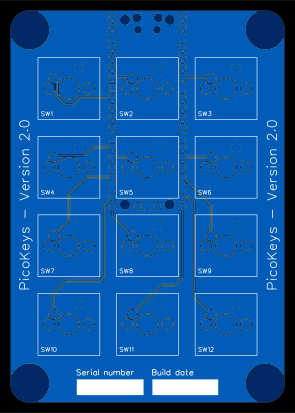
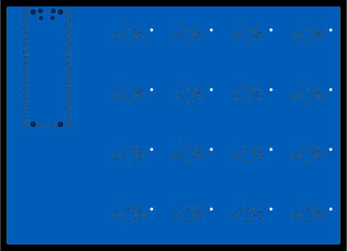
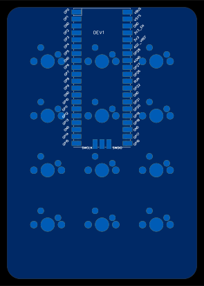
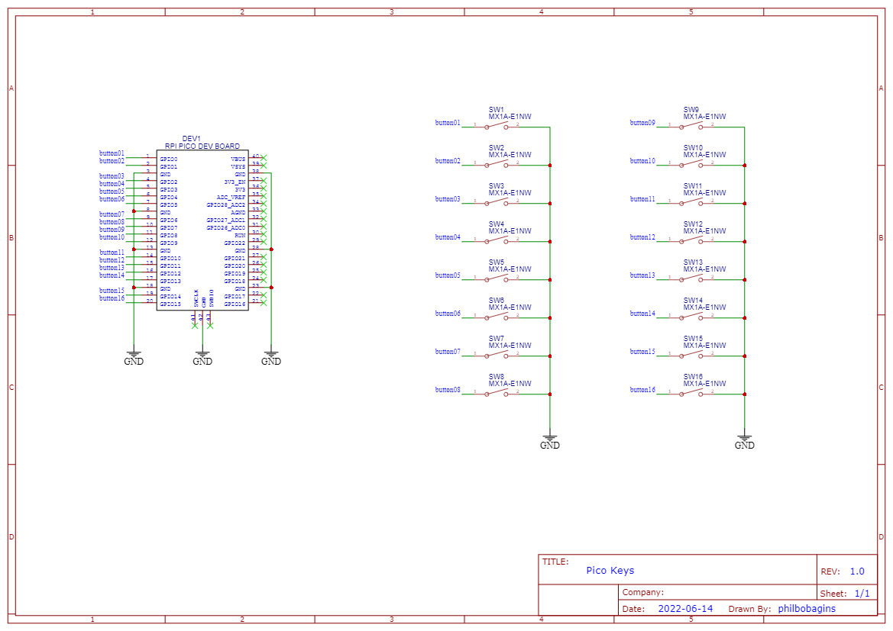
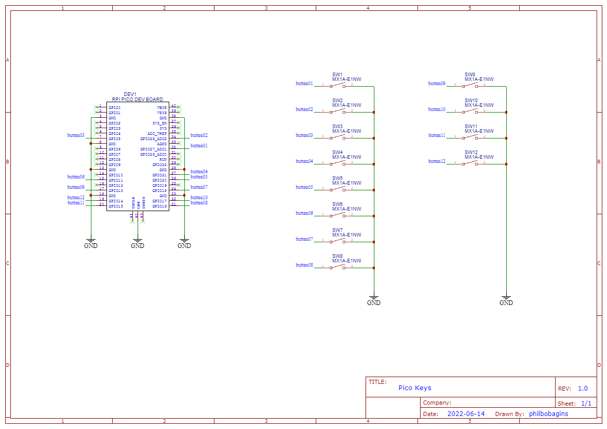
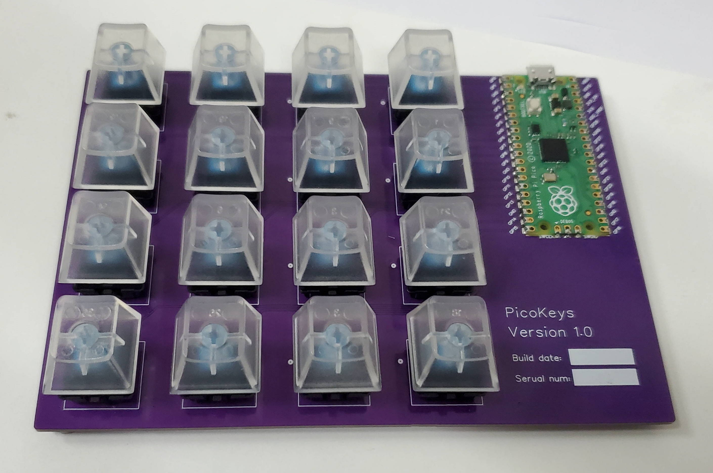
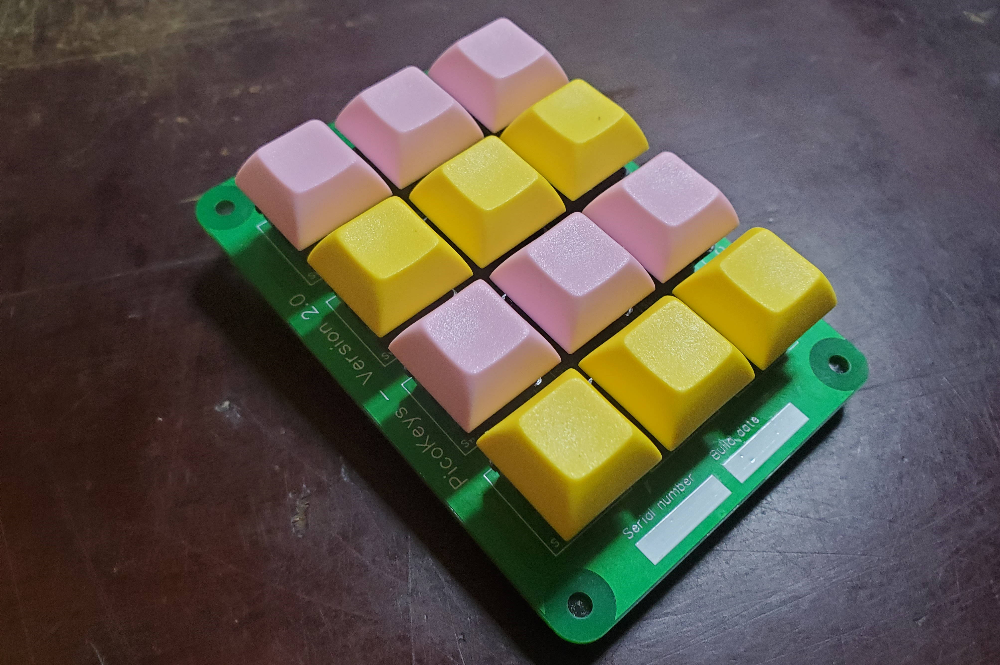

PicoKey PCB
===========

A small macro keyboard using a [RPi Pico](https://www.raspberrypi.com/products/raspberry-pi-pico/).

| Version 1.0                                               | Version 2.0                                               |
| --------------------------------------------------------- | --------------------------------------------------------- |
|               |               |
|         |         |
|  |  |
|        |        |

Components
----------

The standard RPi Pico:

* Official website: <https://www.raspberrypi.com/products/raspberry-pi-pico/>
* DigiKey: <https://www.digikey.com/en/products/detail/raspberry-pi/SC0915/13624793>

Version 2.x board require 2 sets of 1x20 0.1" male headers to mount the RPi Pico. On version 1.x boards, the RPi Pico can be mounted on headers or just soldered down surface mount style.

Any of the following key switches will work:

* Any Cherry MX key switches without LEDs
* TODO: Check if [Akko CS](https://www.pccasegear.com/products/58938/akko-cs-crystal-blue-switches-45-pack) key switches work
* TODO: Check if [Akko POM](https://www.pccasegear.com/products/58934/akko-pom-brown-switches-45-pack) key switches work
* TODO: Check if [Akko x TTC Demon](https://www.pccasegear.com/products/55511/akko-x-ttc-demon-switches-10-pack) key switches work
* TODO: Check if [Gateron MX](https://www.pccasegear.com/products/47910/gateron-mx-switches-blue-120-pack) key switches work
* TODO: Check if [Glorious Forge Fox](https://www.pccasegear.com/products/58769/glorious-forge-fox-switches-120-pack-lubed) key switches work
* TODO: Check if [Glorious Lynx](https://www.pccasegear.com/products/55150/glorious-lynx-switches-36-pack) key switches work
* TODO: Check if [Glorious Panda](https://www.pccasegear.com/products/51561/glorious-panda-switches-36-pack) key switches work
* TODO: Check if [Kailh Box Black](https://www.pccasegear.com/products/51695/kailh-box-black-switches-120-pack) key switches work
* TODO: Check if [Kailh Speed Bronze](https://www.pccasegear.com/products/51696/kailh-speed-bronze-switches-120-pack) key switches work
* TODO: Check if [Mountain Linear Speed](https://www.pccasegear.com/products/57926/mountain-linear-speed-switches-110-pack-lubed) key switches work

Optional: Caps for key switches - TODO: Provide some examples

Optional: Stick on padded bumpers (e.g. <https://www.digikey.com/en/products/filter/bumpers-feet-pads-grips/570>)

Assembly instructions
---------------------

For v1.x boards:

1. Solder key switches and RPi Pico in any order
2. Clean flux
3. Press on key caps (optional)
4. Add stick on padded bumpers to bottom of board (optional)

For v2.x boards, the order things are soldered is a bit more important because of the way the RPi Pico and key switches overlap:

1. Solder 2 sets of 1x20 0.1" male headers to the underside of the board
   1. Recommend placing the RPi Pico over the headers to help keep them aligned but do not solder the RPi Pico yet
2. Clean flux
3. Solder all the key switches
4. Clean flux
5. Solder the RPi Pico to the 0.1" male headers
6. Clean flux
7. Trim the the 0.1" male headers poking through the RPi Pico
8. Press on key caps (optional)
9. Add stand-offs or stick on padded bumpers to bottom of board (optional)

Licence
-------

Copyright © 2022 Phil Baldwin

This work is licensed under a Creative Commons Attribution-ShareAlike 4.0 International License.

You should have received a copy of the license along with this work. If not, see <http://creativecommons.org/licenses/by-sa/4.0/>.
