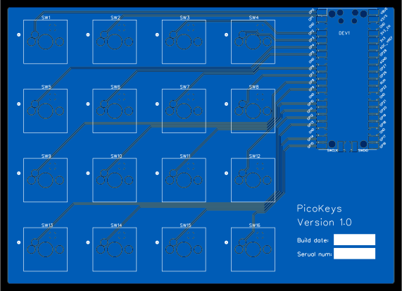

Pico Keys
=========

A small macro keyboard using a [RPi Pico](https://www.raspberrypi.com/products/raspberry-pi-pico/).

Licence
-------

Copyright © 2022 Phil Baldwin

This work is licensed under a Creative Commons Attribution-ShareAlike 4.0 International License.

You should have received a copy of the license along with this work. If not, see http://creativecommons.org/licenses/by-sa/4.0/.
